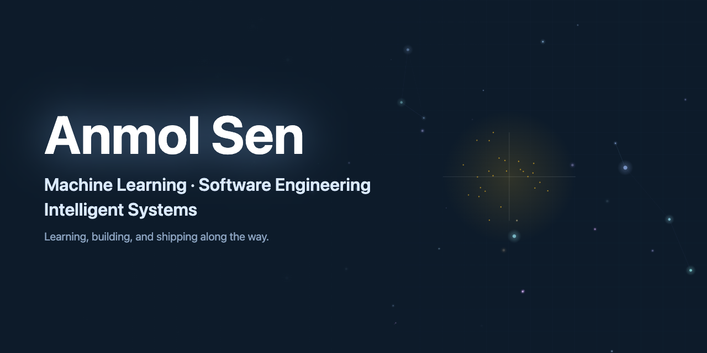

  

## Hi, I'm Anmol Sen👋

I'm a dual-degree student at **BITS Pilani** pursuing **M.Sc. Physics + B.E. Electrical and Electronics Engineering**  
I enjoy building systems that learn from data and solving messy real-world problems with code.

[Resume](https://your-resume-link.com) • 
[Website](https://anmolsen-portfolio.vercel.app) • 
[LinkedIn](https://www.linkedin.com/in/anmol-sen-bits) • 
[Email](mailto:evenindividual@gmail.com)

---

## 💡 About Me

• Interested in Machine Learning, Software Engineering, and Intelligent Systems  
• Enjoy turning ideas and research into real, working projects  
• Like learning by building and shipping consistently  

---

## 🧪 What I'm working on

• Contributing to open-source and improving system design skills  
• Building ML projects and turning ideas into real systems  
• Strengthening DSA and core CS fundamentals  

---

## 🚀 Featured Projects

### Diffusion Model Classifier
Deep learning models that classify anomalous diffusion from short noisy trajectories.  
**Tech:** PyTorch · NumPy · Scientific Python  
🔗 Repo: <repo-link>

---

### Robust Learning with Noisy Labels
Experiments on CIFAR-10 exploring normalized loss functions and the APL framework.  
**Tech:** PyTorch · Experiment Pipelines · Visualization  
🔗 Repo: <repo-link>

---

### Hybrid EfficientNet + ViT Deepfake Detector
Combining CNN local features with transformer global context for deepfake detection.  
**Tech:** Computer Vision · Transformers · Deep Learning  
🔗 Repo: <repo-link>

---

## ⚙️ Tech Stack

### 👨‍💻 Languages
Python · C++ · SQL · Bash · Go 

### 🤖 Machine Learning & Data Science
PyTorch · TensorFlow · Scikit-learn · NumPy · SciPy · Pandas · Matplotlib

### 🛠️ Software & Tools
Git · Linux · Docker · Jupyter · VS Code · Conda 

---

## 📊 GitHub Stats

  

---

## 🌍 Open Source

Interested in contributing to machine learning, developer tools, and scientific computing projects.

---

## ☕ A bit more about me

• I enjoy turning research papers into working code  
• Curious about how things work under the hood  
• Always building something new  

If you’d like to collaborate or just talk tech, feel free to reach out 👋
